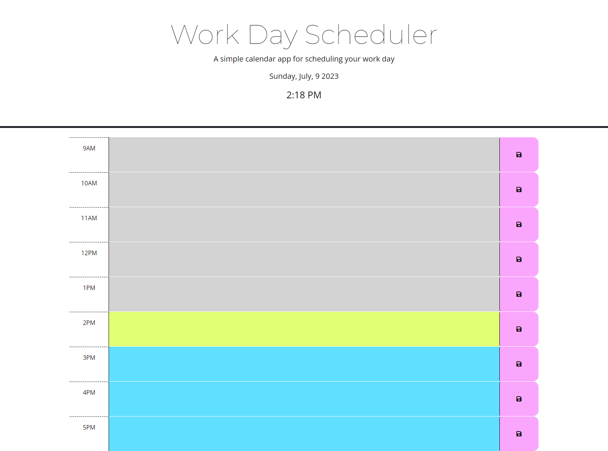

## Work Day Scheduler

## Table of Contents

- [Description](#description)
- [Usage](#usage)
- [Credits](#credits)
- [Link](#live-link)

## Description

As a student and future employee, I have a lot of things on my plate. I need an application that allows me to schedule my day so that I can keep track of my tasks by the hour.

## Usage

To use this application you must select the text box next to the hour of your choosing and type in the event or task you have to attend to for that hour. You can save this task by clicking the pink save button adjacent to your event. The current hour will have a text box with a lime-green background to signify that it is of most importance. The time blocks that occur in the future will have a background color of blue to indicate they are upcoming. The past time blocks with show as grey. The time and date are set to update automatically every second so that the user may have the most updated information. 

Below is a screenshot of this application:

## Credits

Starter code provided by UC Berkeley Extension program.

## Live Link

Click here: https://kaylaasana.github.io/work-day-scheduler/
